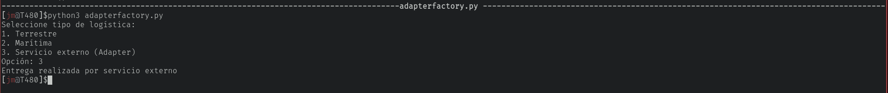
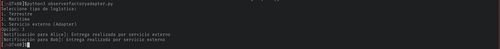

# Taller de Patrones de Diseño
## Singleton (singleton.py)
```python  
class Configuracion:
    _instancia = None

    def __new__(cls):
        if cls._instancia is None:
            print("Creando instancia única...")
            cls._instancia = super().__new__(cls)
            cls._instancia.modo = "Producción"
        return cls._instancia

    def mostrar_configuracion(self):
        print(f"Modo actual: {self.modo}")


def main():
    config1 = Configuracion()
    config2 = Configuracion()

    config1.mostrar_configuracion()

    config2.modo = "Desarrollo"

    config1.mostrar_configuracion()
    config2.mostrar_configuracion()

    # Verificación
    if config1 is config2:
        print("Singleton funcionando: ambas variables son la misma instancia")


if __name__ == "__main__":
    main()
```
- **Resultado:**


- **¿Qué hace este ejemplo?**

La clase `Configuración` solo puede tener una instancia.
`__new__` controla la creación del objeto.
Si ya existe una instancia devuelve la misma.

## Creacional (factory_method.py)
```python
from abc import ABC, abstractmethod


# Producto abstracto
class Transporte(ABC):

    @abstractmethod
    def entregar(self):
        pass


# Productos concretos
class Camion(Transporte):

    def entregar(self):
        return "Entrega realizada por camión 🚚"


class Barco(Transporte):

    def entregar(self):
        return "Entrega realizada por barco 🚢"


# Creator (Factory Method)
class Logistica(ABC):

    @abstractmethod
    def crear_transporte(self):
        pass

    def planificar_entrega(self):
        transporte = self.crear_transporte()
        print(transporte.entregar())


# Creadores concretos
class LogisticaTerrestre(Logistica):

    def crear_transporte(self):
        return Camion()


class LogisticaMaritima(Logistica):

    def crear_transporte(self):
        return Barco()


# Aplicación de consola
def main():
    print("Seleccione tipo de logística:")
    print("1. Terrestre")
    print("2. Marítima")

    opcion = input("Opción: ")

    if opcion == "1":
        logistica = LogisticaTerrestre()
    elif opcion == "2":
        logistica = LogisticaMaritima()
    else:
        print("Opción inválida")
        return

    logistica.planificar_entrega()


if __name__ == "__main__":
    main()
```
- **Resultado:**


- **¿Qué hace este ejemplo?**

`Transporte` define la interfaz común.
`Camion y Barco` son productos concretos.
`Logistica` define el método fábrica crear_transporte().
Las clases concretas deciden qué objeto crear.
El cliente no necesita conocer las clases concretas directamente.
- **Ventajas del patrón Factory Method**

Reduce acoplamiento.
Facilita agregar nuevos tipos de productos.
Hace el código más flexible y mantenible.

## Creacional + Estructural (Factory Method + Adapter)

```python
# =========================
# PATRÓN ESTRUCTURAL: ADAPTER
# =========================

# Servicio externo con interfaz incompatible
class ServicioEnvioExterno:

    def enviar_paquete(self):
        return "Entrega realizada por servicio externo"


# Adapter para que funcione con nuestra interfaz Transporte
class EnvioAdapter(Transporte):

    def __init__(self, servicio_externo):
        self.servicio_externo = servicio_externo

    def entregar(self):
        # Llama al método del servicio externo
        return self.servicio_externo.enviar_paquete()
```

- **Resultado:**


- **¿Qué hace este ejemplo?**
1. Factory Method: Permite crear distintos tipos de transporte sin acoplar el cliente a clases concretas.
2. Adapter: Permite usar un servicio externo con una interfaz diferente sin modificar nuestro sistema.

## Creacional + Estructural + Comportamiento (Factory, Adapter, Observer)

```python

from abc import ABC, abstractmethod

# =========================
# PATRÓN CREACIONAL: FACTORY METHOD
# =========================

# Producto abstracto
class Transporte(ABC):

    @abstractmethod
    def entregar(self):
        pass


# Productos concretos
class Camion(Transporte):

    def entregar(self):
        return "Entrega realizada por camión"


class Barco(Transporte):

    def entregar(self):
        return "Entrega realizada por barco"


# Creator (Factory Method)
class Logistica(ABC):

    @abstractmethod
    def crear_transporte(self):
        pass

    def planificar_entrega(self):
        transporte = self.crear_transporte()
        return transporte.entregar()


# Creadores concretos
class LogisticaTerrestre(Logistica):

    def crear_transporte(self):
        return Camion()


class LogisticaMaritima(Logistica):

    def crear_transporte(self):
        return Barco()


# =========================
# PATRÓN ESTRUCTURAL: ADAPTER
# =========================

# Servicio externo con interfaz incompatible
class ServicioEnvioExterno:

    def enviar_paquete(self):
        return "Entrega realizada por servicio externo"


# Adapter
class EnvioAdapter(Transporte):

    def __init__(self, servicio_externo):
        self.servicio_externo = servicio_externo

    def entregar(self):
        return self.servicio_externo.enviar_paquete()


# =========================
# PATRÓN DE COMPORTAMIENTO: OBSERVER
# =========================

class Observador(ABC):
    @abstractmethod
    def actualizar(self, mensaje):
        pass


class Cliente(Observador):
    def __init__(self, nombre):
        self.nombre = nombre

    def actualizar(self, mensaje):
        print(f"[Notificación para {self.nombre}]: {mensaje}")


class Entrega:
    def __init__(self):
        self.clientes = []

    def agregar_cliente(self, cliente):
        self.clientes.append(cliente)

    def notificar_clientes(self, mensaje):
        for cliente in self.clientes:
            cliente.actualizar(mensaje)

    def realizar_entrega(self, transporte: Transporte):
        resultado = transporte.entregar()
        self.notificar_clientes(resultado)


# =========================
# APLICACIÓN DE CONSOLA
# =========================

def main():
    print("Seleccione tipo de logística:")
    print("1. Terrestre")
    print("2. Marítima")
    print("3. Servicio externo (Adapter)")

    opcion = input("Opción: ")

    if opcion == "1":
        logistica = LogisticaTerrestre()
    elif opcion == "2":
        logistica = LogisticaMaritima()
    elif opcion == "3":
        servicio_externo = ServicioEnvioExterno()
        logistica = EnvioAdapter(servicio_externo)
    else:
        print("Opción inválida")
        return

    # Crear entrega y registrar clientes (Observer)
    entrega = Entrega()
    cliente1 = Cliente("Alice")
    cliente2 = Cliente("Bob")
    entrega.agregar_cliente(cliente1)
    entrega.agregar_cliente(cliente2)

    # Realizar entrega
    if isinstance(logistica, Logistica):
        transporte = logistica.crear_transporte()
    else:
        transporte = logistica  # Adapter ya es un Transporte

    entrega.realizar_entrega(transporte)


if __name__ == "__main__":
    main()
```

- **Resultado:**


- **¿Qué hace este ejemplo?**
Factory Method: Decide qué transporte usar (Camion o Barco).
Adapter: Permite usar un servicio externo de entrega que no cumple la interfaz de Transporte.
Observer: Los clientes registrados reciben notificaciones automáticas cuando se realiza la entrega.
