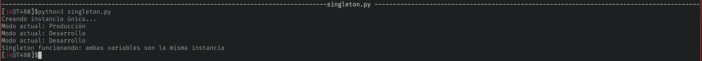
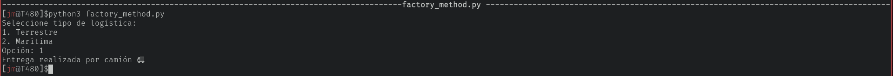

# Taller de Patrones de Diseño
## Singleton (singleton.py)
```python  
class Configuracion:
    _instancia = None

    def __new__(cls):
        if cls._instancia is None:
            print("Creando instancia única...")
            cls._instancia = super().__new__(cls)
            cls._instancia.modo = "Producción"
        return cls._instancia

    def mostrar_configuracion(self):
        print(f"Modo actual: {self.modo}")


def main():
    config1 = Configuracion()
    config2 = Configuracion()

    config1.mostrar_configuracion()

    config2.modo = "Desarrollo"

    config1.mostrar_configuracion()
    config2.mostrar_configuracion()

    # Verificación
    if config1 is config2:
        print("Singleton funcionando: ambas variables son la misma instancia")


if __name__ == "__main__":
    main()
```
- **Resultado:**


- **¿Qué hace este ejemplo?**
La clase `Configuración` solo puede tener una instancia.
`__new__` controla la creación del objeto.
Si ya existe una instancia devuelve la misma.

## Creacional (factory_method.py)
```python
from abc import ABC, abstractmethod


# Producto abstracto
class Transporte(ABC):

    @abstractmethod
    def entregar(self):
        pass


# Productos concretos
class Camion(Transporte):

    def entregar(self):
        return "Entrega realizada por camión 🚚"


class Barco(Transporte):

    def entregar(self):
        return "Entrega realizada por barco 🚢"


# Creator (Factory Method)
class Logistica(ABC):

    @abstractmethod
    def crear_transporte(self):
        pass

    def planificar_entrega(self):
        transporte = self.crear_transporte()
        print(transporte.entregar())


# Creadores concretos
class LogisticaTerrestre(Logistica):

    def crear_transporte(self):
        return Camion()


class LogisticaMaritima(Logistica):

    def crear_transporte(self):
        return Barco()


# Aplicación de consola
def main():
    print("Seleccione tipo de logística:")
    print("1. Terrestre")
    print("2. Marítima")

    opcion = input("Opción: ")

    if opcion == "1":
        logistica = LogisticaTerrestre()
    elif opcion == "2":
        logistica = LogisticaMaritima()
    else:
        print("Opción inválida")
        return

    logistica.planificar_entrega()


if __name__ == "__main__":
    main()
```
- **Resultado:**


- **¿Qué hace este ejemplo?**
`Transporte` define la interfaz común.
`Camion y Barco` son productos concretos.
`Logistica` define el método fábrica crear_transporte().
Las clases concretas deciden qué objeto crear.
El cliente no necesita conocer las clases concretas directamente.
- **Ventajas del patrón Factory Method**
Reduce acoplamiento.
Facilita agregar nuevos tipos de productos.
Hace el código más flexible y mantenible.
