# Práctica Consumo de API Remota con SSH
En este laboratorio se configura un servidor node.js remoto y se consume información de este a través del protocolo SSH más solicitudes HTTP.

## Conección al servidor aws remoto

- **Introducción del comando a la consola para conectarse con el servidor ssh remoto:**
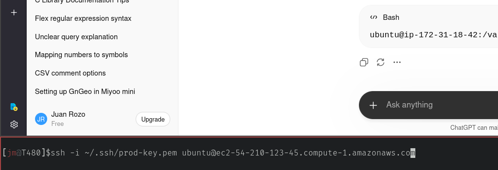
- **Acceso a la consola del servidor remoto:**
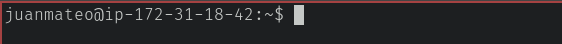

## Configuración del servidor node.js
- **Organización de los archivos en el directorio y arranque del servidor:**
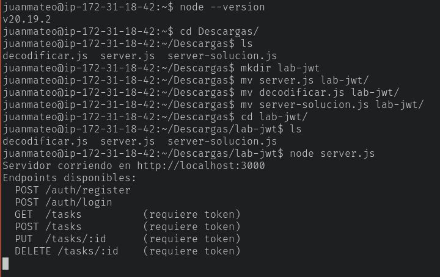

## Ejecución de solicitudes 
- **Register:**
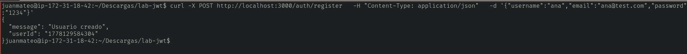
- **Login:**
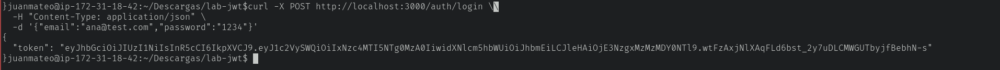
- **Token:**
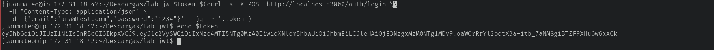
- **Obtener tareas:**
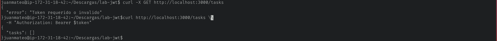
- **Crear tareas:**
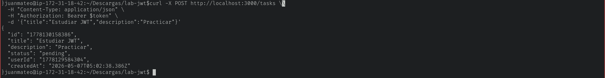
- **Listar tareas:**
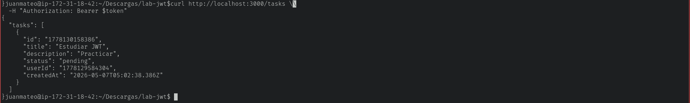

## Validación, Endpoint, PUT y DELETE

- **Crear tareas:**
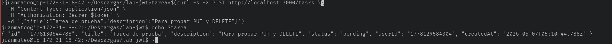
- **PUT:**
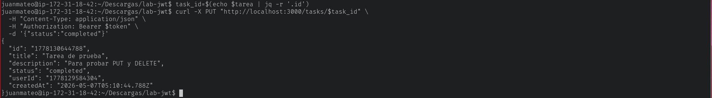
- **DELETE:**
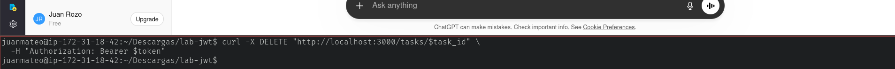

