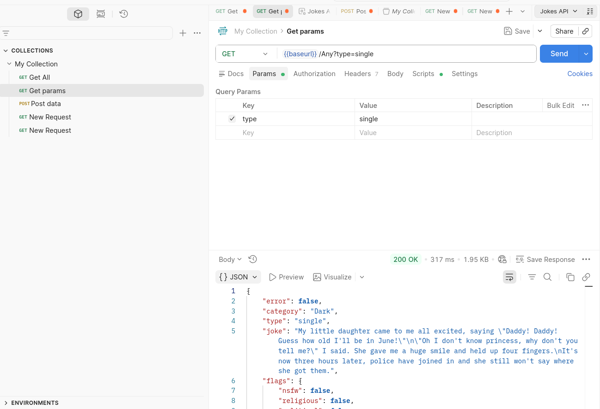
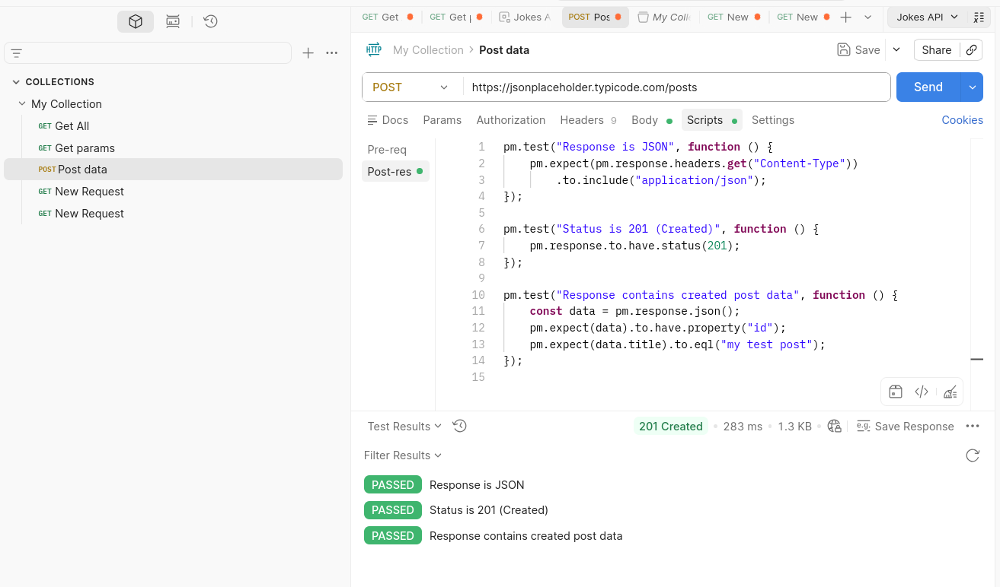
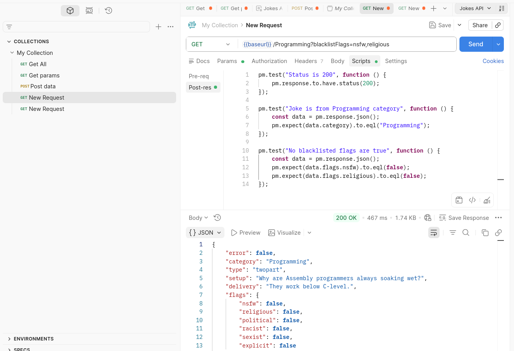
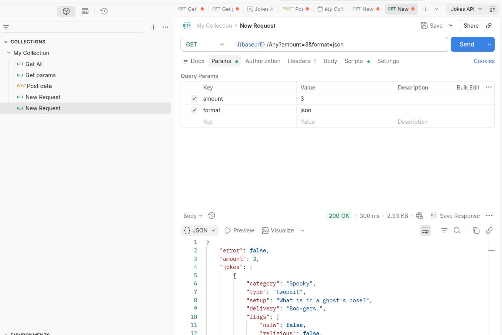

# Tarea APIs
## Pantallazos de Requests en Postman
### GET todos recursos

### GET Filtrando un Campo

### POST
Realizado a jsonplaceholder porque la api de bromas no soporta POST.

### GET filtrando múltiples campos 1 resultado

### GET 3 resultados sin filtro

# Respuesta a las preguntas
## API seleccionada
Elegí la API **JokeAPI (https://v2.jokeapi.dev/)** porque permite realizar múltiples tipos de consultas con parámetros (filtros), lo que facilita cumplir los requisitos del ejercicio (GET general, filtrado, uso de query params, etc.). Además, es pública, gratuita y no requiere configuración compleja.

## ¿Qué datos devuelve?
La API devuelve **chistes en formato JSON**. Dependiendo de la consulta, puede retornar:

- Un solo chiste (`type: "single"`)
- Un chiste en dos partes (`setup` + `delivery`)
- Múltiples chistes (usando `amount`)
- Metadatos como:
  - `category` (categoría del chiste)
  - `type` (single o twopart)
  - `flags` (contenido sensible)
  - `id` (identificador del chiste)

## ¿Usa token o no? ¿Qué tipo?
No utiliza ningún tipo de autenticación.

- ❌ No requiere API Key  
- ❌ No usa tokens (Bearer, OAuth, etc.)  
- ✔ Es una API completamente pública  

## ¿Qué código de estado recibiste en cada request?

- GET (todos los recursos): `200 OK`
- GET (filtrado con query params): `200 OK`
- POST (usando JSONPlaceholder): `201 Created`
- GET (free request 1): `200 OK`
- GET (free request 2): `200 OK`

## ¿Qué aprendiste diferente a JSONPlaceholder?

- JokeAPI es una API **dinámica**, ya que los datos cambian en cada request (chistes aleatorios), mientras que JSONPlaceholder devuelve datos fijos.
- JokeAPI utiliza **query parameters para filtrar resultados**, en lugar de rutas REST tradicionales como `/posts/1`.
- JSONPlaceholder permite operaciones completas de tipo REST (GET, POST, PUT, DELETE), mientras que JokeAPI es **solo de lectura (GET)**.
- En JokeAPI fue necesario manejar aspectos como el formato de respuesta (`format=json`) y encabezados (`Accept`), lo que no fue necesario en JSONPlaceholder.
- Se evidenció la importancia de la **configuración de headers y entorno en Postman**, ya que puede afectar el tipo de respuesta (HTML vs JSON).
